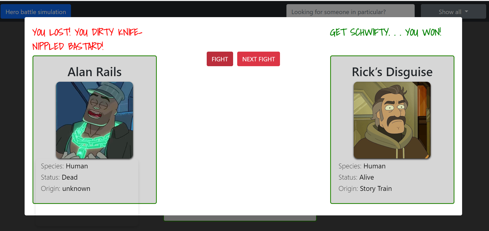

# RickAndMortyDEX

## GitHub Pages URL: https://michalguspiel.github.io/RickAndMortyDEX/

Pair work: Michał Guspiel & Matt Simpson (https://github.com/MattiHel85)

Rick and Morty dex is a web app built using vanilla JavaScript and using AJAX to pull data from rickandmortyapi.com.

## Features implemented
- Fuzzy search
- Filter
- Display cards for each character
- Battle card game

## Screenshots

    
     
    
     
    
     
    
     
    
     
    

### Future improvements
- Improve mobile responsiveness
- UI improvement (move away from obvious bootstrap styles)
- Add animations to battle card game